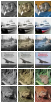

# Automatic Image Colorization using U-Net (PyTorch)

## Overview
This project implements an automatic image colorization system using a U-Net architecture in PyTorch. The model learns to predict realistic RGB color images from grayscale inputs, trained end-to-end on the CIFAR-10 dataset. The codebase is modular, well-documented, and designed for clarity and reproducibility.

## Model Architecture
- **U-Net**: An encoder-decoder convolutional neural network with skip connections.
- **Input**: 1-channel grayscale image (32x32).
- **Output**: 3-channel RGB image (32x32), with pixel values in [0, 1].
- **Loss**: L1 loss between predicted and ground-truth color images.

## Dataset (CIFAR-10)
- **Source**: [CIFAR-10](https://www.cs.toronto.edu/~kriz/cifar.html) (60,000 32x32 color images in 10 classes).
- **Preprocessing**: Each image is converted to grayscale for input; the original color image is used as the target.
- **Splits**: Standard CIFAR-10 train/test split.

## Training Instructions
1. **Install dependencies**:
   ```bash
   pip install torch torchvision tqdm scikit-image matplotlib
   ```
2. **Train the model**:
   ```bash
   python colorization_unet.py --epochs 30 --batch-size 128 --lr 1e-3
   ```
   - Training will use GPU (CUDA) if available and print the device.
   - Model checkpoints are saved to `best_unet_colorization.pt` based on best validation SSIM.
   - Sample colorization results are saved in the `samples/` directory after each epoch.

## Inference Usage
Run colorization on a custom grayscale image:
```bash
python inference.py --image path/to/grayscale.png --model-path best_unet_colorization.pt --out result.png --upscale
```
- The script loads the trained U-Net, preprocesses the input, and saves a side-by-side image showing the grayscale input, predicted color, and (optionally) upscaled prediction.
- See `inference.py --help` for all options.

## Metrics (SSIM/PSNR)
- **SSIM (Structural Similarity Index)**: Measures perceptual similarity between predicted and ground-truth color images.
- **PSNR (Peak Signal-to-Noise Ratio)**: Quantifies pixel-wise reconstruction quality.
- Both metrics are computed on the validation set after each epoch.

## Sample Outputs
| Grayscale Input | Predicted Color | Ground Truth |
|:--------------:|:--------------:|:------------:|
|  |  |  |

*Replace the above with actual sample images from your `samples/` directory after training.*

## Future Improvements
- Train on higher-resolution or more diverse datasets (e.g., ImageNet, Places).
- Experiment with perceptual or adversarial losses for more realistic colorization.
- Add data augmentation and regularization.
- Support for larger images and batch inference.
- Interactive web demo or notebook interface.

---
**Hardware Used for Training**: NVIDIA RTX 4070 GPU (but code runs on any CUDA or CPU device).

For questions or suggestions, feel free to open an issue or contact the author.
